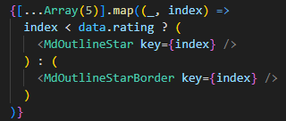

# dokumentation AndreasNielsen

## START

**Opgavens navn:** SPACE VENTURE  
**Navn:** Andreas Nielsen  
**Klasse:** webith124  
**Skole:** Viden Djurs  
**Afleveringsdato:** 5/12/2025

**Bekræftelse:**  
_Jeg bekræfter hermed, at jeg selvstændigt og uden brug af AI og hjælp fra andre har udviklet det afleverede eksamensprojekt._

---

## Indledning

- Intro
- fdsfsd
- fdsfds
- fsdf

---

## Tech Stack

#### Framework

- REACT - jsx
- Vite
- Css / Sass

#### Npm dependencies

- Axios: er til XMLHttpRequest
- React-icons: er icons til siden
- Quill: En Editer for text og innerHTML
- Dompurify: for at sanitize innerHTML

---

## Test Oplysninger

- **APP URL:** [localhost:5173](http://localhost:5173/)
- **APP StartUp:**
  `cd frontend (vis ikke i frontend)`
  /
  `npm i`
  /
  `npm run dev`

- **For Login:**
  - **URL**: `/Login`
  - **Email**: sp@spaceventure.dk
  - **Password**: admin123

---

## Tidsplan, Estimat og To-Do Liste

Jeg har organiseret min opgave vha. Trello, hvor jeg har planlagt opgaver, estimeret tid, og tracket mine fremskridt.

**Trello Board Link:**

- [Trello link](https://trello.com/invite/b/67e12ca3a50b2cc085bf3cd4/ATTI432c7b37cccf9538f3fdbc659e7567a8DC2390A2/webith124-andreasnielsen)

**Github link:** [min Github](http://localhost:5173/)

**Tidsplan, Estimat**

- "6 dag / 8 timer per dag"
                                                                                    
|  **Dag**        | **formiddag** | **middag** | **aften** |
| --------------  | ------        | ------     | -------   |
| **Dag: 1** |   Jeg starter med at gennemgå dokumentationen og opgavebeskrivelsen og sætter så min boilerplate op, og starter bare sådan og starter ud på de generelle funktioner og så videre.  |  Jeg har fået sat header'en og footer'en op, og er begyndt at arbejde på forsiden med de forskellige komponenter Der skulle være Jeg synes selv jeg ikke er god til at være systematisk og at have en specifik ordre i at gøre opgaven men jeg følger prioritetslisten så godt jeg kan, Jeg har fået lavet en del af forsiden,  som for eksempel de forskellige banner/slider, og jeg opretter de fleste filer til at starte med, opdatering Jeg har også redigeret lidt i sliderne   |   jeg har nu tilføjet et banner komponent som nu holder silder / banner, samt et galleri, info, teams og TurePreview til forsiden og har tilføjet alle de andre pages Der skal bruges,  |
| **Dag: 2**    |    Jeg har tilføjet ture komponentet og en nedtæller til turene, Jeg føler jeg har en god fart men føler også Jeg sidder for meget fast i specifikke problemer, Jeg har slettet den statiske slider til banneret og tilføje et udvalgt Tour styling  |    Jeg føler jeg er begyndt at sidde en lille smule fast da jeg ikke er særlig god til at forstå opgaven Men det kan også godt være fordi jeg er dårlig til at læse men jeg arbejder videre Jeg har slettet min search komponent da det er et tilvalgsopgave Og jeg vil hellere prioritere på mere vigtige dele  |    Jeg har tilføjet kontaktformen til kontaktsiden, jeg har nu brugt det meste af dagen på at lave små ændringer og lave det meste af at stylinge der er en af mine yndlingsdele er at Style    | 
| **Dag: 3**     |    Jeg er i gang med at få slideren til at virke i galleri componentet og Det går meget stille og roligt, jeg har nu stylet en del af det og sat error handling op og er næsten færdig      |   Jeg har siddet en del fast nu på at finde en måde at registrere om useren resizer skærm, men har fundet en god metode at gøre det med en use State og en eventlessner, den er god på grund af jeg kan implementere den Flere steder hvis jeg har brug for det     |   Jeg har tilføjet en basic SEO struktur i html.index-filen Jeg vender tilbage til den senere Jeg gider ikke at arbejde på den lige nu,  Jeg har siddet og rykket rundt i en del af stylingen og er usikker på hvilken måde jeg skal sætte det op med sections og artikler Jeg prøver at Google lidt rundt, Jeg gav op på det og begyndte at fokusere på local Gallery og lightboxen til det    |
| **Dag: 4**     |   jeg har nu fået sat en del op Det er meget kørende, Jeg har implementeret nogle nye bannere til de andre sider da jeg synes det vil passe meget godt og har tilføjet selectedTour til udvalgtur page,      |   Jeg har implementeret Dompurify og rykket rundt på titelstrukturen så det er nemmere at sætte op for search engines og så videre.. Jeg har også fået redigeret i headeren og footeren, så de passer mere til designet og funktionaliteten matcher    |   Jeg har fået en permitteret quill og sat det generelle redigeringer op i admin, opdatering!:  jeg har nu tilføjet Siden hvor man kan redigere turene og et component til at uploade, Jeg kunne ikke få det til at virke med at uploade det som et component og jeg føler at det vil være lettere hvis jeg laver det til pages i stedet for. opdatering igen: jeg har nu fået det meste af redigeringer og uploade til at virke på ture som er ekstremt fedt!     |
| **Dag: 5**     |    Det går sgu meget godt Jeg har fået quill setup, bortset fra at jeg har fået en del Errors Jeg har spurgt videre og fundet ud af at det er en forkert version Jeg bruger og jeg prøver at se om jeg kan fikse det og da jeg har arbejdet alene Har det været svært at få svar på nogle af de ting som jeg var usikker på men jeg er begyndt at få svar på dem Så jeg begynder at lave ændringer til det    |   jeg har nu fået alle delene i footeren og headeren til at virke, som er super fedt og åbenbart var der fejl med på position sticky som jeg brugte en del tid på og Generelt funktionaliteten er at få harmonika menuen til at åbne Jeg har brugt det meste af tiden på at redigere fejl og ting, der enten var for komplicerede eller kunne forenkles.     |   Ja nu begyndte lige så stille og redigere små detaljer og tjekke af alt folk somaliteten virker Jeg har opdagede nogle fejl med post som jeg gerne skulle have fikset og begynder at er det kommentarer til min kode så jeg kan forstå den NOTE!  Jeg tilføjer en del kommentarer på grund af at jeg har hukommelsesproblemer og hukommelsesbesvær så det er for at hjælpe mig med at huske det meste om en uge eller to. og jeg begynder også på at færdiggøre min rapport   |
| **Dag: 6**     |    ADD    |   fds     |   fds     |

---

## Tilvalgsopgaver
#### Brugers afmelding af nyhedsbrev
- mens jeg lavede nyhedsbrevet overvejet jeg også om brugeren kunne afmelde nyhedsbrevet så jeg implementeret også at den gemmer når det er du har meldt dig til for at give dig muligheden for at afmelde.
- se: `NewsLetter.jsx` commpont
#### Nedtæller til næste tur/afgang
- Jeg har tilføjet en nedtæller på Ture siden og viser datoen inde på udvalgt ture.
- se: `CountdownTimer.jsx` og `Trips.jsx` commponts
#### Giv mulighed for at rate ★ ★ ★ ★ ★
- Jeg tilføjer en rating ved at lave en Array og map det map det ud og tjekke hvis indexet er højere rating. 
- 
- se: `SelectedTure.jsx` commpont
#### Login – authentication (Session-cookie)
- Jeg har tilføjet login funktionalitet som vi har lært men jeg også Har eksperimenteret med og jeg vil sige jeg har fået et godt resultat ud af det
- se: `LoginContext.jsx` commpont

## bilage