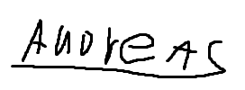

# Webith124 Exam Dokumentation

## Forside

**Opgavens navn:** SPACE VENTURE  
**Navn:** Andreas Nielsen  
**Klasse:** webith124  
**Skole:** Viden Djurs  
**Afleveringsdato:** 4/12/2025

**Bekræftelse:**  
_Jeg bekræfter hermed, at jeg selvstændigt og uden brug af AI og hjælp fra andre har udviklet det afleverede eksamensprojekt._

---

## Indledning

Denne dokumentation beskriver udviklingen af "Dit Hjem"-projektet, en webløsning udviklet som en del af eksamen i Webith124.
Projektet blev udviklet med React og en række tredjepartsbiblioteker for at sikre en responsiv og moderne brugeroplevelse.

Jeg har primært fokuseret på at skabe en brugervenlig og effektiv løsning med optimeret ydeevne. Undervejs har jeg foretaget flere beslutninger omkring teknologi og arkitektur for at forbedre funktionaliteten og skalerbarheden af applikationen.

---

## Tech Stack

| Teknologi | Beskrivelse        | Fordele                                             | Ulemper                                    |
| --------- | ------------------ | --------------------------------------------------- | ------------------------------------------ |
| **React** | Frontend framework | Hurtig, komponentbaseret udvikling, stort community | Kan være tungt for simple projekter        |
| **Vite**  | Byggeværktøj       | Hurtig udviklingsserver, moderne modulsystem        | Ikke altid kompatibel med ældre npm-pakker |
| **Axios** | HTTP-klient        | Simpel API-håndtering, understøtter async/await     | Kan erstattes af fetch API                 |
| **Sass**  | CSS Preprocessor   | Lettere at organisere CSS-kode                      | Kræver prækompilering                      |

---

## Overvejelser og Valg

Under udviklingen af projektet har jeg truffet en række valg for at optimere performance og skalerbarhed:

- **State Management:** Jeg har valgt at benytte Reacts indbyggede state management i stedet for Redux for at holde projektet simpelt og hurtigt.
- **Autentifikation:** Login-systemet er baseret på en simpel token-baseret autentifikation for at sikre brugervenlighed og sikkerhed.
- **Responsivt Design:** Projektet er optimeret til både desktop og mobil vha. fleksible grid-layouts og media queries.
- **API-forbedringer:** Jeg har optimeret API-kald ved at implementere caching, hvilket reducerer unødvendige anmodninger.

---

## Test Oplysninger

- **API URL:** [127.0.0.1:5020](ttp://127.0.0.1:5020)
- **API StartUp:** `cd app-api && npm i && npm start`

- **APP URL:** [localhost:5173](http://localhost:5173/)
- **APP StartUp:** `cd vite-app && npm i && npm run dev`

- **For Login:**
  - **URL**: `/Login`
  - **Email**: CodeWizard@byteMe.com
  - **Password**: npmRunThis123!

---

## Tidsplan, Estimat og To-Do Liste

Jeg har organiseret min opgave vha. Trello, hvor jeg har planlagt opgaver, estimeret tid, og tracket mine fremskridt.

- **Trello Board Link:** [Trello](https://trello.com/invite/b/67e12ca3a50b2cc085bf3cd4/ATTI432c7b37cccf9538f3fdbc659e7567a8DC2390A2/webith124-andreasnielsen)

---

## Tilvalgsopgaver

I forbindelse med eksamensopgaven har jeg valgt at inkludere følgende tilvalgsopgaver:

- Implementering af dark mode
- Dynamisk routing med React Router
- Integration af tredjeparts API

---

## Bilag

- **Tidsplan**: [Link til tidsplan eller billede af Trello-board]
- **Kodeeksempler**: [Uddrag af vigtige kodeelementer]
- **Screenshots**: [Screenshots af applikationen og udviklingsprocessen]

---

Dette dokument er en sammenfatning af mit arbejde og de beslutninger, der blev taget undervejs i udviklingsprocessen.
